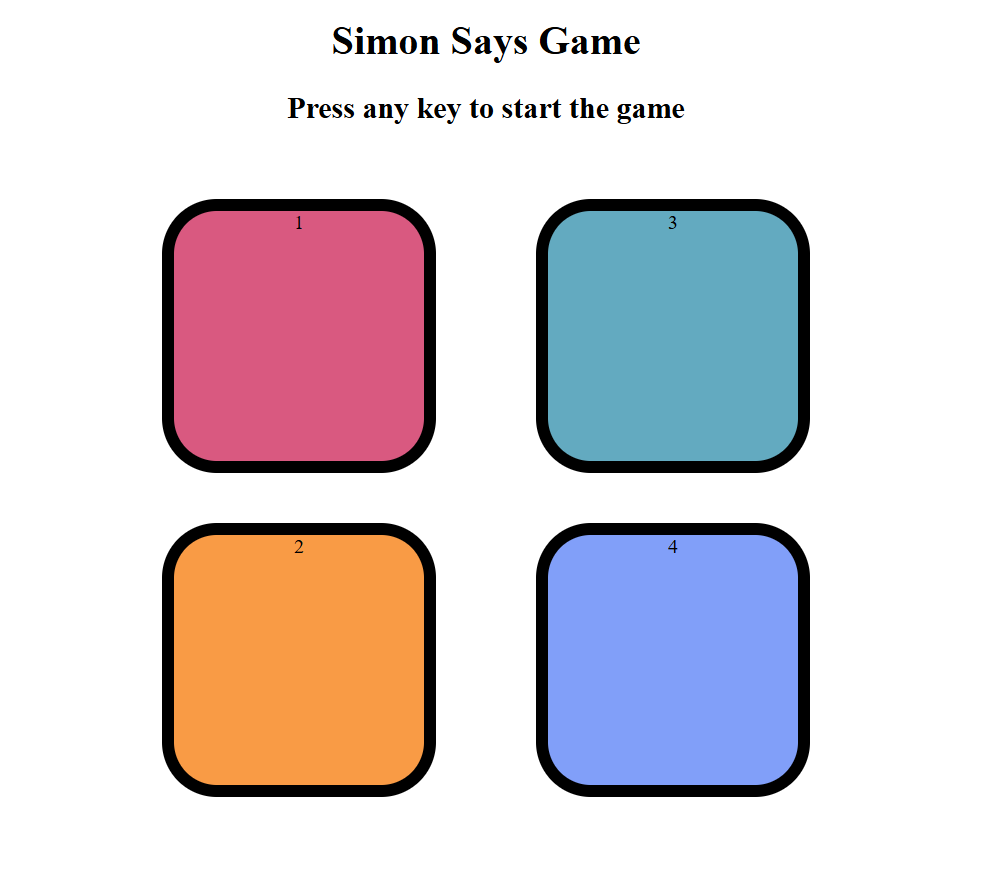

<h1 align="center">🎮 Simon Game 🎮</h1>

<p align="center">
  A simple memory-based game made with HTML, CSS, and JavaScript.  
  <br><br>
  <b>Press any key to start the game</b> and try to follow the color sequence!
</p>

---

## 🛠️ Tech Stack

- **HTML5**
- **CSS3**
- **Vanilla JavaScript**

---
## 📸 Screenshot

<p align="center">
  
</p>

---


## 📁 Folder Structure
```text
simon-game/
│
├── index.html
├── style.css
├── app.js
└── screenshot.png
```
---

## 🧠 How to Play

1. Press any key to start.
2. Watch the flash sequence.
3. Repeat the sequence by clicking the colored boxes.
4. Sequence gets longer with every level.
5. Game ends when you click the wrong box.

---

## 🚀 Getting Started

Clone the repo and run it locally:

```bash
git clone https://github.com/anuj-singal/simon-game.git
cd simon-game
open index.html
```
---

## 👨‍💻 Author
<p>
  <a href="https://github.com/anuj-singal" target="_blank">
    
  </a>
</p>
